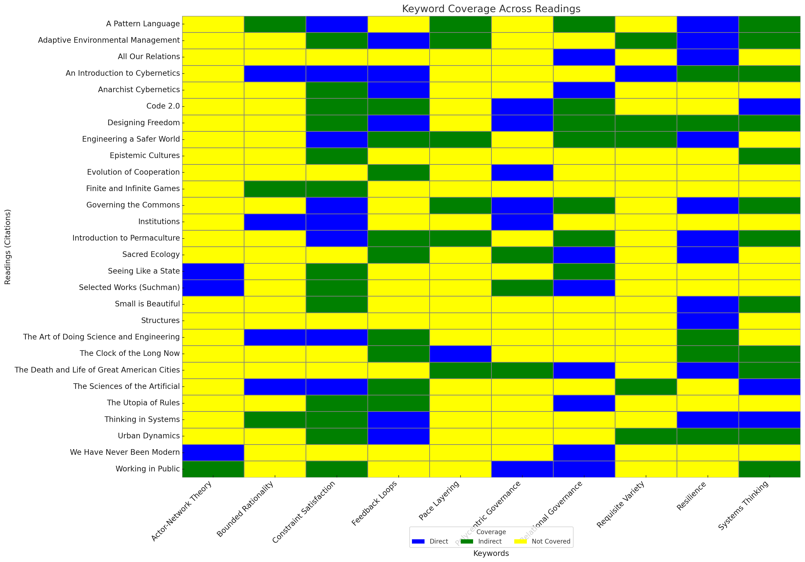

# This Is Not a Test

## Overview
**This Is Not a Test** explores how to build and rehabilitate **institutions** capable of sustaining **healthy relationships** with the **planet**, **biosphere**, and **each other**. It draws on **systems thinking**, **governance frameworks**, and **design processes** to confront **complexity**, **trade-offs**, and **constraint satisfaction** in **adaptive systems**.

### Course Structure
The course is divided into **three modules**, each exploring a **core idea** through **theory**, **practice**, and **synthesis**:

### License

cc-by-sa-4

### Warning

I wrote this in one sitting. We can remove this flag after other contributors have reviewed and refined the content.

### Contribute

Pull requests welcome. Please provide an explanation of the proposed changes. I reserve the right to reject pull requests, as well as the right to edit further before merging.

---

## **1. Models and Their Limits**

- **[Abstract](1_Models_and_Their_Limits/1_Abstract.md)** - Module overview and key themes
- **[Glossary](1_Models_and_Their_Limits/1_Glossary.md)** - Key terms and concepts
- **[Questions](1_Models_and_Their_Limits/1_Questions.md)** - Discussion questions and prompts

### **Theory (1.1)**  
- **[1.1.0 – A Primer](1_Models_and_Their_Limits/1.1_Theory/1.1.0_A_Primer.md)** – *Thinking in Systems* (Meadows) *(Systems Thinking and Feedback Loops)*  
- **[1.1.1 – Pace Layering](1_Models_and_Their_Limits/1.1_Theory/1.1.1_Pace_Layering.md)** – *The Clock of the Long Now* (Brand) *(Time Scales and Stability)*  
- **[1.1.2 – A Pattern Language](1_Models_and_Their_Limits/1.1_Theory/1.1.2_Pattern_Language.md)** – *A Pattern Language* (Alexander) *(Spatial Design and Modularity)*  
- **[1.1.3 – Requisite Variety](1_Models_and_Their_Limits/1.1_Theory/1.1.3_Requisite_Variety.md)** – *An Introduction to Cybernetics* (Ashby) *(Control, Adaptation, and Complexity)*  

### **Practice (1.2)**  
- **[1.2.1 – Urban Dynamics](1_Models_and_Their_Limits/1.2_Practice/1.2.1_Urban_Dynamics.md)** – *Urban Dynamics* (Forrester) *(Feedback in Urban Systems)*  
- **[1.2.2 – Epistemic Cultures](1_Models_and_Their_Limits/1.2_Practice/1.2.2_Epistemic_Cultures.md)** – *Epistemic Cultures* (Knorr Cetina) *(Timescales in Knowledge Systems)*  
- **[1.2.3 – Introduction to Permaculture](1_Models_and_Their_Limits/1.2_Practice/1.2.3_Introduction_to_Permaculture.md)** – *Introduction to Permaculture* (Mollison & Slay) *(Patterns in Natural Systems)*  

### **Synthesis (1.3)**  
- **[1.3.1 – Small is Beautiful](1_Models_and_Their_Limits/1.3_Synthesis/1.3.1_Small_is_Beautiful.md)** – *Small is Beautiful* (Schumacher) *(Local Resilience and Adaptability)*  
- **[1.3.2 – Structures](1_Models_and_Their_Limits/1.3_Synthesis/1.3.2_Structures.md)** – *Structures* (Gordon) *(Design, Integrity, and Failure Analysis)*  
- **[1.3.3 – Panarchy](1_Models_and_Their_Limits/1.3_Synthesis/1.3.3_Panarchy.md)** – *Adaptive Environmental Management* (Holling) *(Cycles, Change, and Resilience)*  

---

## **2. Collective Action and Institutions**

- **[Abstract](2_Collective_Action_and_Institutions/2_Abstract.md)** - Module overview and key themes
- **[Glossary](2_Collective_Action_and_Institutions/2_Glossary.md)** - Key terms and concepts  
- **[Questions](2_Collective_Action_and_Institutions/2_Questions.md)** - Discussion questions and prompts

### **Theory (2.1)**  
- **[2.1.1 – Code 2.0](2_Collective_Action_and_Institutions/2.1_Theory/2.1.1_Code_2.0.md)** – *Code 2.0* (Lessig) *(Architecture as Regulation)*  
- **[2.1.2 – Institutions](2_Collective_Action_and_Institutions/2.1_Theory/2.1.2_Institutions.md)** – *Institutions* (North) *(Formal Rules and Governance)*  
- **[2.1.3 – Evolution of Cooperation](2_Collective_Action_and_Institutions/2.1_Theory/2.1.3_Evolution_of_Cooperation.md)** – *The Evolution of Cooperation* (Axelrod) *(Game Theory and Trust)*  

### **Practice (2.2)**  
- **[2.2.1 – Working in Public](2_Collective_Action_and_Institutions/2.2_Practice/2.2.1_Working_in_Public.md)** – *Working in Public* (Eghbal) *(Open-Source Governance and Platforms)*  
- **[2.2.2 – Selected Works](2_Collective_Action_and_Institutions/2.2_Practice/2.2.2_Selected_Works.md)** – *Lucy Suchman* *(Technology and Social Practices)*  
- **[2.2.3 – Sacred Ecology](2_Collective_Action_and_Institutions/2.2_Practice/2.2.3_Sacred_Ecology.md)** – *Sacred Ecology* (Berkes) *(Ecological Governance and Traditional Knowledge)*  

### **Synthesis (2.3)**  
- **[2.3.1 – Governing the Commons](2_Collective_Action_and_Institutions/2.3_Synthesis/2.3.1_Governing_the_Commons.md)** – *Governing the Commons* (Ostrom) *(Commons Governance and Polycentric Systems)*  
- **[2.3.2 – Seeing Like a State](2_Collective_Action_and_Institutions/2.3_Synthesis/2.3.2_Seeing_Like_State.md)** – *Seeing Like a State* (Scott) *(Centralization and Local Knowledge)*  
- **[2.3.3 – The Death and Life of Great American Cities](2_Collective_Action_and_Institutions/2.3_Synthesis/2.3.3_Death_and_Life.md)** – *The Death and Life of Great American Cities* (Jacobs) *(Urban Complexity and Order)*  

---

## **3. Design, Analysis, and Governance**

- **[Abstract](3_Design_Analysis_and_Governance/3_Abstract.md)** - Module overview and key themes
- **[Glossary](3_Design_Analysis_and_Governance/3_Glossary.md)** - Key terms and concepts
- **[Questions](3_Design_Analysis_and_Governance/3_Questions.md)** - Discussion questions and prompts

### **Theory (3.1)**  
- **[3.1.1 – Finite and Infinite Games](3_Design_Analysis_and_Governance/3.1_Theory/3.1.1_Finite_and_Infinite_Games.md)** – *Finite and Infinite Games* (Carse) *(Philosophy of Design Goals)*  
- **[3.1.2 – The Sciences of the Artificial](3_Design_Analysis_and_Governance/3.1_Theory/3.1.2_Sciences_of_the_Artificial.md)** – *The Sciences of the Artificial* (Simon) *(Design Heuristics and Adaptability)*  
- **[3.1.3 – The Art of Doing Science and Engineering](3_Design_Analysis_and_Governance/3.1_Theory/3.1.3_Art_of_Doing_Science.md)** – *Judgment and Process Thinking* (Hamming)  

### **Practice (3.2)**  
- **[3.2.1 – The Utopia of Rules](3_Design_Analysis_and_Governance/3.2_Practice/3.2.1_Utopia_of_Rules.md)** – *The Utopia of Rules* (Graeber) *(Bureaucracy and Governance)*  
- **[3.2.2 – Anarchist Cybernetics](3_Design_Analysis_and_Governance/3.2_Practice/3.2.2_Anarchist_Cybernetics.md)** – *Anarchist Cybernetics* (Swann) *(Decentralized Control Systems)*  
- **[3.2.3 – All Our Relations](3_Design_Analysis_and_Governance/3.2_Practice/3.2.3_All_Our_Relations.md)** – *All Our Relations* (LaDuke) *(Indigenous Governance Models)*  

### **Synthesis (3.3)**  
- **[3.3.1 – Designing Freedom](3_Design_Analysis_and_Governance/3.3_Synthesis/3.3.1_Designing_Freedom.md)** – *Designing Freedom* (Beer) *(Cybernetics and Autonomy)*  
- **[3.3.2 – Engineering a Safer World](3_Design_Analysis_and_Governance/3.3_Synthesis/3.3.2_Engineering_Safer_World.md)** – *Engineering a Safer World* (Leveson) *(Safety and Systems Thinking)*  
- **[3.3.3 – We Have Never Been Modern](3_Design_Analysis_and_Governance/3.3_Synthesis/3.3.3_Never_Been_Modern.md)** – *We Have Never Been Modern* (Latour) *(Actor-Networks and Hybridity)*  

---
## **Relationships**

### **Keyword Coverage**
See [Keywords](keywords.md) for detailed definitions and examples of key concepts used throughout the readings.

### **Reading-Keyword Matrix**
See [Relationships](relationships.csv) for a detailed mapping of how each reading relates to key concepts.

The relationships between readings and keywords range from:
- **Direct** - Explicitly covers and develops the concept
- **Indirect** - Touches on or applies the concept without direct discussion
- **Not Covered** - Does not substantially engage with the concept

This mapping helps identify:
- Core texts for specific concepts
- Complementary readings that approach topics differently

---
See the [Reading List](Readings.md) for the primary materials.

See the [Supplementary Materials](Supplementary_Materials.md) for additional readings.
